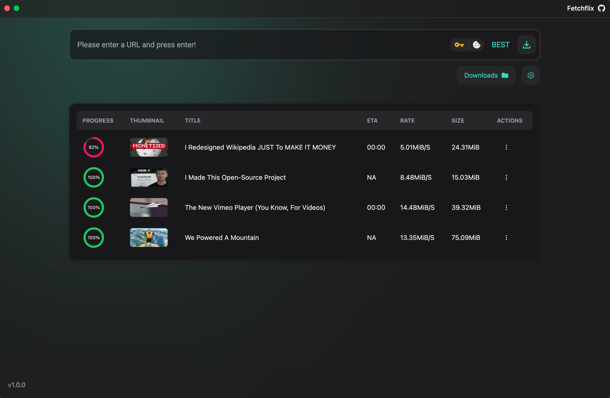

<p align="center">
  <p align="center">
   
  </p>
	<h1 align="center"><b>Fetchflix</b></h1>
	<p align="center">
		Beautifully structured UI for YTDL
    <br />
    <br />
    <b>Click <a href="https://github.com/thepioneers-team/fetchflix/releases">here</a> to see download options</b>
  </p>
</p>

Fetchflix is an open source cross-platform ytdl manager, that aims to enhance the users experience with youtube-dl
<br/>

Organize and manage ytdl downloads with ease in one place. Interact and manage all of ytdl's options and settings through a beautiful and responsive interface.

<p align="center">
  
</p>

# Motivation

Many of us have wanted to download a video from the internet. Whether its from YouTube, Instagram, or some other random app. For a while there wasn't a solution but an CLI tool called youtube-dl came out. However, its been a while since its been updated. So a fork of it was made called yt-dlp (thats what we use). But again, its a CLI command not really useable for the normal person. So we decided to make a GUI for the CLI tool to help the average Joe out

# Developer Guide

Please refer to the [contributing guide](CONTRIBUTING.md) for how to install Fetchflix from sources.

### Install

```bash
$ pnpm install
```

### Development

```bash
$ pnpm dev
```

### Build

```bash
# For windows
$ pnpm build:win

# For macOS
$ pnpm build:mac

# For Linux
$ pnpm build:linux
```
